# SpeakFare GroupSync — одна большая карта работы агента

> Историческая схема раннего агентного цикла. С тех пор модели больше не
> видны низкоуровневые `search_*`: в production allow-list только
> `plan_group_sync` и `plan_individual_trip`, `agent_max_steps` по умолчанию
> 20, добавлены SafetyGate, conversation, STT и глобус.
>
> Актуальная архитектура: [docs/ARCHITECTURE.md](docs/ARCHITECTURE.md).
> Пользовательский вход: [../README.md](../README.md).

```mermaid
flowchart TD
    subgraph LEGEND["Легенда цветов"]
        LEG_U["User / security gate"]
        LEG_H["Harness / UI / orchestration"]
        LEG_L["LLM / модель"]
        LEG_A["Agent-core / deterministic logic"]
        LEG_E["Environment / external runtime"]
    end

    subgraph INPUT["1. Вход пользователя и web-harness"]
        U1["Пользователь\nпишет текстовый запрос на русском"]
        H1["FastAPI · web.py\n/ · /search · /api/search"]
        H2["Валидация query\nбез PII-автоматизации и без desktop tools"]
        H3["GroupSyncService.run(text)\nсоздаёт новый request-scoped run"]
        H4["ObservedTutuInventory\nпустой доверенный inventory для этого run"]
        H5["LiveGroupAgent\nсоздаёт PlanningSession + ToolRegistry"]
    end

    subgraph PROMPT["2. Агентный цикл: кто принимает решение"]
        A1["Travel-only system prompt\nнет файлов, shell, браузера, почты,\nкалендаря, аккаунтов или памяти пользователя"]
        H6["AgentRuntime\nmax_steps = 8\ntools выполняются последовательно"]
        H7["Provider messages\nrole=system + role=user + прошлые role=tool"]
        E1["OpenRouter API\nprovider = Baseten\nreasoning enabled"]
        L1["LLM: deepseek/deepseek-v4-flash-0731\nсам выбирает следующий шаг"]
        L2{"Что нужно сделать\nна этом шаге?"}
        L3["Финальный ответ\nструктурно, по существу, на русском"]
        H8["AgentTrace\nтолько видимые tool calls / status\nбез hidden reasoning"]
        H9["reasoning / reasoning_details\nвозвращаются модели только в следующем call\nне попадают в UI и trace"]
        H10{"Остались шаги\nдо лимита?"}
        H11["Честная ошибка\nлимит agent loop исчерпан"]
    end

    subgraph REGISTRY["3. Реестр tool-ов: что модель может выбрать"]
        R0["ToolRegistry\nJSON schema + allow-list + sequential executor"]
        R1["plan_group_sync\nпредпочтительный полный путь для группы"]
        R2["get_avia_instructions\nget_rail_instructions\nget_bus_instructions\nget_etrain_instructions\nget_hotels_instructions\nget_multitransport_instructions"]
        R3["search_avia · search_rail · search_bus\nsearch_etrain · search_hotels\nsearch_multitransport"]
        R4["get_offer_details\nget_rail_seatmap"]
        R5["solve_group_rendezvous\ninspect_offer_risks\nget_search_health"]
        R6["НЕ видно модели:\ncreate_checkout_link\nфайловая система / shell / браузер / почта"]
        R7["Tool result или tool error\nвозвращается как role=tool"]
    end

    subgraph MCP["4. Внешний travel runtime"]
        H12["TutuMcpGateway\nPython-обёртки доменных tools"]
        H13["StreamableHttpMcpClient\nJSON-RPC / SSE · handshake · session\nкорреляция batch сообщений · reinit после 404"]
        E2["Tutu MCP\nживые инструкции и travel inventory"]
        E3["Авиа · ЖД · автобусы · электрички\nотели · мультитранспорт\nдетали предложений и seat map"]
        E4["create_checkout_link\nвнешний handoff, не бронь и не оплата"]
        E5["MCP transport / tool error\nвозвращается честно, без выдуманного результата"]
        H21["Вернуть Tutu tool result\nи observe offer только если он есть"]
    end

    subgraph PLAN["5. Полный путь plan_group_sync внутри PlanningSession"]
        P0["Tool arguments\ncontract + date + common_mode + feeder_mode"]
        P1["GroupTripContract.from_mapping()\nучастники · точный hub · destination\nmin/max wait · strict baggage"]
        P2["Проверить дату, режимы и\nколичество взрослых каждого участника"]
        P3["Сначала получить инструкции Туту\nдля каждого используемого domain"]
        P4["Найти common offer\nhub → destination\nна сумму пассажиров всей группы"]
        P5["Для каждого участника найти feeder\norigin → hub\nна его число пассажиров"]
        P6["ObservedTutuInventory.observe_tool_result()\nсохранить только original MCP snapshots"]
        P7["expand_offer_variants()\nсвязать exact fare с parent raw offer\nи сохранить offer_hash / service_class"]
        P8["service.solve_group_rendezvous()\nв solver передаются только trusted MCP snapshots"]
        P9["build_group_presentation()\nдоговор · timeline · scenarios · evidence\nrejection summary · public tariffs"]
        P10["Private checkout components\nточный ref + expected passengers\nне попадают в browser response"]
        P11["RunStore.put()\nсоздать opaque run_id\nredact checkout_ref для UI"]
    end

    subgraph SOLVER["6. Детерминированный GroupSync solver и объяснимые риски"]
        S1["normalize_offer / Offer × Variant\nsegments · time · airport/station\nprice · baggage · conditions"]
        S2["Hard filters\nточный hub/destination\nавиа — строго по коду, IST ≠ SAW\nпоезд и автобус — город из названия станции\nодин общий final service\nmin_wait ≤ wait ≤ max_wait\nstrict baggage\nправильное число пассажиров"]
        S3["Rejection summary\nсчётчики отсева по каждой причине"]
        S4["Risk engine\npass / risk / unknown"]
        S5["Структурные риски\nis_multi_pnr / отдельные покупки\nночная пересадка\nсмена IST ↔ SAW\nменее 4 часов буфера\nсквозной багаж unknown"]
        S6["GroupScenario\ncommon segment + feeder каждого человека"]
        S7["Rank сценариев\nцена · max wait · длительность\nчисло рисков · разброс прибытия"]
        S8["В чат уходит один вариант"]
    end

    subgraph CONCESSION["7. Доп-функция «Цена одной уступки»"]
        C1{"Baseline = 0\nподходящих сценариев?"}
        C2["Найти реальные исключения\nтолько выше max_wait"]
        C3["Выбрать минимальное увеличение\nникогда не уменьшать min_wait"]
        C4["Pure solver re-run\nте же MCP snapshots, все hard rules сохранены"]
        C5{"Сохранены hub, общий service,\nвсе участники и status = pass?"}
        C6["Public proposal\nfrom / to / delta / причина\nбез offer, price, URL и checkout_ref"]
        C7["Нет безопасной уступки\nне показывать карточку"]
    end

    subgraph OUTPUT["8. Пользовательский экран"]
        W1["UI получает только public presentation\nи compact visible trace"]
        W2["Карточка договора\nhard constraints / soft preferences"]
        W3["Timeline фидеров и общего плеча"]
        W4["Scenario cards\nподтверждено / риск / неизвестно"]
        W5["Сводка: почему часть вариантов\nне попала в рекомендации"]
        W6["Для каждого компонента:\nручной выбор точного тарифа"]
        W7["Карточка «Цена одной уступки»\nтолько при безопасном proposal"]
    end

    subgraph CHECKOUT["9. Безопасный handoff на Туту"]
        U2["Пользователь выбирает variant\nи нажимает «Перейти на Туту»"]
        W8["POST /api/checkout\nтолько run_id + component_ref + variant_id"]
        H14["RunStore.claim_variant()\nrun active? component/variant существуют?\nвзять короткую checkout lease"]
        G1["checkout_handoff_guard()\nexplicit selection · exact ref\nexpected passengers · selected variant"]
        G2{"Все проверки\nпрошли?"}
        G3["422: нет handoff\nне вызвать внешний MCP"]
        H15["Взять private original checkout_ref\nbyte-for-byte из RunStore"]
        E6["Tutu MCP.create_checkout_link(private ref)"]
        W9["Показать deeplink или search redirect\nпопросить проверить рейс, тариф\nи пассажиров до оплаты"]
        H16["release checkout lease"]
        X1["Browser НИКОГДА не получает\nи не отправляет checkout_ref"]
    end

    subgraph REPLAN["10. Серверный fresh replan после уступки"]
        U3["Пользователь нажимает\n«Подтвердить и пересчитать»"]
        W10["POST /concession/replan\nтолько run_id + displayed max_wait"]
        H17["RunStore.begin_concession_replan()\nprivate recipe совпадает с public card?\nclaim: active → replanning"]
        G4["LiveGroupAgent.replan_concession(recipe)\nБЕЗ нового LLM turn\nизменить только max_wait"]
        H18["Новый Tutu поиск + тот же solver\nчерез новый PlanningSession"]
        G5{"Новый run\nсобран?"}
        H19["commit_concession_replan()\nновый random run_id = active\nстарый = superseded"]
        H20["abort_concession_replan()\nстарый run обратно active"]
        X2["Старый checkout / повторный replan\nпосле commit запрещены"]
        X3["Нельзя параллельно:\nreplan и checkout lease"]
    end

    subgraph QUALITY["11. Наблюдаемость и проверка реализации"]
        Q1["OpenRouter retry\nтолько model HTTP 429/5xx/TransportError\nдо исполнения любого tool"]
        Q2["Tutu tools и checkout\nникогда не retried автоматически"]
        Q3["test_openrouter.py\nBaseten payload + retry"]
        Q4["test_runtime.py\nloop + trace + tool execution"]
        Q5["test_solver.py\nварианты, риски, guard"]
        Q6["test_constraint_negotiator.py\nминимальная безопасная уступка"]
        Q7["test_application.py\nLLM → FakeTutu → solver → handoff"]
        Q8["test_web.py\nUI, API, explicit selection, replan"]
        Q9["39 automated tests\nбез реального ключа и без сети"]
    end

    %% Начальный запуск
    U1 --> H1 --> H2 --> H3
    H3 --> H4
    H3 --> H5
    H5 --> A1 --> H6 --> H7 --> E1 --> L1 --> L2
    H6 --> H8
    L1 --> H9
    E1 -.->|"429 / 5xx / transport error"| Q1
    Q1 --> E1

    %% Выбор model tool и агентный цикл
    L2 -->|"достаточно данных о группе"| R1
    L2 -->|"нужны travel-данные"| R0
    L2 -->|"не хватает даты / точного hub / destination"| L3
    L2 -->|"есть доказательный ответ"| L3
    R0 --> R2
    R0 --> R3
    R0 --> R4
    R0 --> R5
    R0 -.->|"недоступно"| R6
    R5 --> R7
    R7 --> H10
    H10 -->|"да"| E1
    H10 -->|"нет"| H11

    %% Низкоуровневый путь в Туту
    R2 --> H12
    R3 --> H12
    R4 --> H12
    R5 --> H12
    H12 --> H13 --> E2 --> E3
    E2 -->|"ошибка"| E5 --> R7
    E3 --> H21 --> R7

    %% Внутренности plan_group_sync
    R1 --> P0 --> P1 --> P2 --> P3
    P3 --> H12
    P3 --> P4
    P4 --> H12
    P4 --> P5
    P5 --> H12
    P5 --> P6
    P6 --> P7 --> P8
    P8 --> S1 --> S2
    S2 -->|"hard fail"| S3
    S2 -->|"подходит по hard rules"| S4 --> S5 --> S6 --> S7 --> S8 --> P9
    S2 --> C1
    C1 -->|"да"| C2 --> C3 --> C4 --> C5
    C5 -->|"да"| C6 --> P9
    C5 -->|"нет"| C7 --> P9
    C1 -->|"нет"| P9
    S3 --> P9
    P9 --> P10 --> P11 --> W1
    P11 --> R7

    %% Пользовательский результат
    W1 --> W2
    W1 --> W3
    W1 --> W4
    W1 --> W5
    W1 --> W6
    C6 --> W7
    W4 --> U2
    W6 --> U2
    W7 --> U3

    %% Checkout
    U2 --> W8 --> H14 --> G1 --> G2
    G2 -->|"нет"| G3 --> W1
    G2 -->|"да"| H15 --> E6 --> E4 --> W9 --> U1
    E6 --> H16
    H14 -.->|"защищено"| X1
    H14 -.->|"lease"| X3
    E4 -.->|"не бронь / не оплата"| W9

    %% Серверный replan
    U3 --> W10 --> H17 --> G4 --> H18 --> P0
    H18 --> G5
    G5 -->|"успех"| H19 --> W1
    G5 -->|"ошибка"| H20 --> W1
    H19 -.->|"закрывает источник"| X2
    H17 -.->|"не стартует при checkout lease"| X3

    %% Quality lane
    H6 -.->|"модельный транспорт"| Q1
    H12 -.->|"без авто-retry side effect"| Q2
    Q1 --> Q3
    H6 --> Q4
    S2 --> Q5
    C4 --> Q6
    P11 --> Q7
    W8 --> Q8
    Q3 --> Q9
    Q4 --> Q9
    Q5 --> Q9
    Q6 --> Q9
    Q7 --> Q9
    Q8 --> Q9

    %% Точные цвета референсной главной диаграммы
    classDef llm fill:#FED7AA,stroke:#F59E0B,color:#9A3412,stroke-width:2px;
    classDef agent fill:#BBF7D0,stroke:#10B981,color:#065F46,stroke-width:2px;
    classDef harness fill:#BFDBFE,stroke:#2563EB,color:#1E3A8A,stroke-width:2px;
    classDef environment fill:#E9D5FF,stroke:#9333EA,color:#6B21A8,stroke-width:2px;
    classDef user fill:#FECACA,stroke:#DC2626,color:#7F1D1D,stroke-width:2px;

    class LEG_U,U1,U2,U3,G3,X1,X2,X3 user;
    class LEG_H,H1,H2,H3,H4,H5,H6,H7,H8,H9,H10,H11,H12,H13,H14,H15,H16,H17,H18,H19,H20,H21,W1,W2,W3,W4,W5,W6,W7,W8,W9,W10 harness;
    class LEG_L,L1,L2,L3 llm;
    class LEG_A,A1,R0,R1,R2,R3,R4,R5,R6,R7,P0,P1,P2,P3,P4,P5,P6,P7,P8,P9,P10,P11,S1,S2,S3,S4,S5,S6,S7,S8,C1,C2,C3,C4,C5,C6,C7,G1,G2,G4,G5,Q1,Q2,Q3,Q4,Q5,Q6,Q7,Q8,Q9 agent;
    class LEG_E,E1,E2,E3,E4,E5,E6 environment;
```

